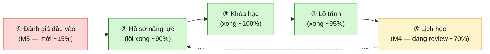
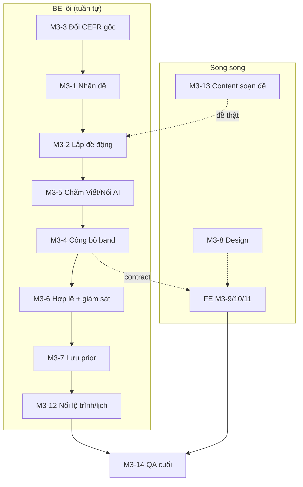

# Outline tiến độ & Kế hoạch — Đánh giá · Hồ sơ · Khóa học · Lộ trình · Lịch học

> **Mục đích:** tổng hợp kiểu SRS, **góc nhìn non-tech**, mô tả **bằng ví dụ**, cho 4 mảng lõi của sản phẩm — kèm **tiến độ thật trên Plane** và **kế hoạch hoàn thiện + làm Module M3**.
> **Tài liệu liên quan:** [`srs-luong-du-lieu-danh-gia-khoa-hoc-lo-trinh-lich-hoc.md`](./srs-luong-du-lieu-danh-gia-khoa-hoc-lo-trinh-lich-hoc.md) (luồng dữ liệu chi tiết) · [`so-do-phu-du-lieu-khoa-hoc-va-lo-trinh.md`](./so-do-phu-du-lieu-khoa-hoc-va-lo-trinh.md) (bản xem nhanh bằng ví dụ).
> **Nhân vật ví dụ xuyên suốt — "An":** Đọc A2 · Nói/Viết B1 · Nghe/Ngữ pháp B2 · tổng B1 · đích B2 (≈ IELTS 6.5).

---

## 0. Bức tranh chung — 1 dây chuyền 5 mắt xích

4 mảng là **1 dây chuyền**. An làm bài **đánh giá** → ra **hồ sơ năng lực** → hệ thống chọn **khóa học** phủ đúng trình độ → rút thành **lộ trình** cá nhân → **lịch học** rải bài ra từng ngày.



> **Nút thắt của cả sản phẩm:** 3 mắt xích giữa (hồ sơ / khóa / lộ trình) đã xong nhưng **đang "chờ mồi"** từ M3. Hoàn thiện M3 sẽ **thông toàn bộ dây chuyền**.

---

## 1. ① Đánh giá năng lực đầu vào — *Module M3 (Fixed Mode)* 🔴 ~15%

**Chức năng:** cho học viên mới làm 1 bài ~15–20 phút, mỗi lượt **lắp một đề riêng** từ ngân hàng câu, rồi quy về **band CEFR** để dựng hồ sơ.

**Ví dụ (An):** An chọn mục tiêu *"Luyện thi IELTS"* → hệ thống gán **cấu hình Full** (có cả Viết + Nói). Kiểm micro/mạng, đồng ý ghi âm → lắp đề (loại các bài đã gặp lần trước) → chụp "ảnh đề" cố định → An làm Nghe → Đọc → Dùng-từ → Viết → Nói theo thứ tự, **không quay lại**. Nộp → máy chấm ra **2 con số**: *band công bố* và *band hồ sơ*, kèm biểu đồ điểm mạnh/yếu.

| Trạng thái | Việc |
|---|---|
| 🟡 Đang làm | Màn chuẩn bị (M3-9) · Màn làm bài (M3-10) · Màn kết quả (M3-11) · Sửa timer *(đã xong, PRD-124)* |
| 🔴 Chưa làm | **Lõi BE:** nhãn phân loại đề (M3-1) · lắp đề động + ảnh chụp đề (M3-2) · **đổi thang chấm gốc → CEFR** (M3-3) · quy tắc công bố band (M3-4) · chấm Viết/Nói bằng AI (M3-5) · kiểm hợp lệ + giám sát (M3-6) · lưu prior (M3-7) · **nối kết quả → lộ trình/lịch (M3-12)** · **Content soạn ngân hàng đề (M3-13)** · Design (M3-8) · QA (M3-14) |

> **Điểm nghẽn thật:** BE lắp đề (M3-2) cần **ngân hàng đề đã gắn nhãn** (M3-1 + Content M3-13). Hiện `band-scoring.js` còn lấy **IELTS làm gốc** — phải sửa sang **CEFR làm gốc** (M3-3) thì cả dây chuyền mới đúng bản chất.

---

## 2. ② Hồ sơ năng lực — *đầu ra đánh giá + theo dõi liên tục* ✅ ~90%

**Chức năng:** lưu trình độ từng kỹ năng dưới dạng **bandPoint liên tục** (vd Đọc = 2.4 = "A2 khá") thay vì chỉ nhãn thô; **tự nhích lên** khi học viên qua checkpoint.

**Ví dụ (An):** sau đánh giá, hồ sơ An = {Đọc 2.4 · Nói 3.1 · Viết 3.0 · Nghe 4.2 · Ngữ pháp 4.1}. Học xong 1 chặng, qua checkpoint → Đọc nhích 2.4 → 2.7, hồ sơ **tự cập nhật**.

| Trạng thái | Việc |
|---|---|
| ✅ Xong | bandPoint liên tục + snapshot + re-plan (PRD-25) · Checkpoint chấm điểm, gate, nâng band (PRD-24) · Học thích ứng v3 (PRD-13) |
| 🔴 Chờ | Nguồn nạp **ban đầu** từ M3 (M3-12) — hồ sơ chạy tốt cho người *đang học*, chưa có "mồi" từ bài đánh giá đầu vào |

---

## 3. ③ Khóa học — *sản phẩm "phủ dải điểm"* ✅ ~100%

**Chức năng:** mỗi khóa là 1 sản phẩm nâng học viên **từ band → tới band** (IELTS/TOEIC/CEFR "từ mấy đến mấy"). Admin import bằng `.xlsx`.

**Ví dụ (An):** khóa *"Tăng tốc 6.5"* phủ **B1 → B2** (IELTS ~5.0 → 6.5) → hợp với An. Khóa *"Nền tảng 5.0"* (B1→B1) quá dễ, *"Nâng cao 8.0"* (B2→C1) vượt đích → loại.

| Trạng thái | Việc |
|---|---|
| ✅ Xong | Hệ thống khóa học + Import `.xlsx` (PRD-10) · FE khóa học (PRD-21) · Course Media + Study Gate (PRD-14) |

---

## 4. ④ Lộ trình — *rút từ khóa theo chỗ yếu* ✅ ~95%

**Chức năng:** từ khóa, chỉ **giữ phần kỹ năng còn yếu** (khoảng cách ≥ 1 band tới trần khóa), bỏ phần đã đạt; xếp trần thấp học trước.

**Ví dụ (An):** lộ trình giữ **Đọc + Nói + Viết** (An yếu), **bỏ Nghe + Ngữ pháp** (đã B2 = đạt đích). Khi An band-up, lộ trình **re-plan**.

| Trạng thái | Việc |
|---|---|
| ✅ Xong | Lộ trình thích nghi: bandPoint, snapshot, re-plan (PRD-25) · Adaptive path-builder (chọn khóa theo trần) · Checkpoint gate (PRD-24) |

---

## 5. ⑤ Lịch học — *Module M4* 🟡 ~70%

**Chức năng:** rải bài của lộ trình ra **từng ngày** theo thời gian rảnh học viên khai; **tự dời lịch** khi trễ; nhắc học.

**Ví dụ (An):** An khai T2-T4-T6, 90′/buổi, hạn 8 tuần → chọn mức **Cấp tốc (450′/tuần)**. Máy rải: T2 = 2 quiz Đọc (20′×2) + 1 lý thuyết (15′); bài Viết 60′ chiếm nguyên 1 ngày; checkpoint xếp ngày riêng; CN gom ôn. An nghỉ 3 hôm → lịch **tự dồn lại**.

| Trạng thái | Việc |
|---|---|
| 🟡 Đang review/test | Chia lộ trình thành nhiệm vụ ngày (M4-1) · Thuật toán sinh lịch (M4-3) · API + tự sắp lại khi trễ (M4-4) · Thời lượng ước tính bài (M4-0) · UI lịch + nhiệm vụ ngày (M4-6) · Contract *(đã xong, PRD-123)* |
| 🔴 Chưa làm | Thông báo nhắc học (M4-5) · Ôn tập thông minh v3 (M4-9) · Checkpoint chặn cứng + lùi lịch ôn lại (M4-10) · Design màn khai báo (M4-2) · QA (M4-7) |

---

## 6. Ảnh chụp nhanh tiến độ

| Mảng | Lõi | Còn lại chính |
|---|---|---|
| ① Đánh giá (M3) | 🔴 **~15% (chỉ FE đang dựng)** | Toàn bộ BE lõi + ngân hàng đề |
| ② Hồ sơ năng lực | ✅ ~90% | Nạp ban đầu từ M3 |
| ③ Khóa học | ✅ ~100% | — |
| ④ Lộ trình | ✅ ~95% | Nối từ M3 |
| ⑤ Lịch học (M4) | 🟡 ~70% | Nhắc học, ôn thông minh, checkpoint chặn, QA |

---

## 7. Định hướng kế hoạch (đã chốt)

### 7.1 Bốn quyết định

| # | Quyết định | Hệ quả |
|---|---|---|
| 1 | **Đóng M4 trước → rồi dồn M3** | Đẩy nốt review/test M4 cho "đóng gói" 1 mảng, rồi toàn đội vào M3. Có sản phẩm demo sớm. |
| 2 | **M3 làm Full ngay (4 kỹ năng)** | Cần **AI chấm Viết/Nói** (M3-5) là **dependency cứng** + phụ thuộc dịch vụ ngoài. |
| 3 | **M3 bắt đầu từ BE lõi** (đổi CEFR + lắp đề) | Sửa `band-scoring.js` sang CEFR-gốc là việc nền, làm trước. |
| 4 | **Luôn đo đủ 4 kỹ năng** → band ghi đủ | **OQ-1 khép lại** — không có bản Core 2/4, không lo band tổng thấp bất thường. |

> **Lưu ý quyết định #4:** vì luôn đo đủ 4 kỹ năng, việc "công bố band chỉ 2/4" biến mất. **Nhưng** cặp *band công bố vs band hồ sơ* vẫn giữ cho **trường hợp lỗi** (vd micro hỏng giữa chừng → Nói *chưa đo*, EC-002): band hồ sơ bỏ kỹ năng thiếu, band công bố tính mức thấp nhất + cảnh báo. Edge case, không phải luồng chính.

### 7.2 Giai đoạn A — Đóng M4 (lịch học)

Ưu tiên đẩy **M4-1 / M4-3 / M4-4 / M4-6** (đang *in review/testing*) qua "done", rồi làm 3 việc todo + QA:

- Thông báo nhắc học (M4-5)
- Ôn tập thông minh v3 — ưu tiên bài sai + giãn ngắt quãng (M4-9)
- Checkpoint chặn cứng + vòng lùi-lịch ôn lại (M4-10)
- Design màn khai báo thời gian (M4-2)
- QA lịch + thông báo (M4-7)

### 7.3 Giai đoạn B — M3, thứ tự theo phụ thuộc

```
1. M3-3  Đổi thang chấm gốc → CEFR       (nền, gỡ nợ band-scoring.js)
2. M3-1  Gắn nhãn ngân hàng đề            (skill · itemType · targetCefr — cần cho lắp đề)
3. M3-2  Bộ lắp đề động + ảnh chụp đề      (lõi)
4. M3-5  Chấm Viết/Nói bằng AI            (BẮT BUỘC vì Full)
5. M3-4  Quy tắc công bố band            (band công bố / hồ sơ, xử lý "chưa đo")
6. M3-6  Kiểm hợp lệ + giám sát
7. M3-7  Lưu prior (cho adaptive sau)
8. M3-12 Nối kết quả → lộ trình + lịch     (thông toàn bộ dây chuyền)
```

**Chạy song song ngay từ đầu** (không chờ BE):

- **M3-13 Content soạn ngân hàng đề** — ⚠️ "BE lõi trước" **không** bỏ được việc này: không có đề thật thì M3-2 chỉ test được bằng mock. Content phải khởi động **song song** để BE có đề kiểm chứng.
- **M3-8 Design** + tiếp tục **FE M3-9/10/11** (đang dở) với contract từ BE.
- **M3-14 QA** ở cuối mỗi nhánh.




