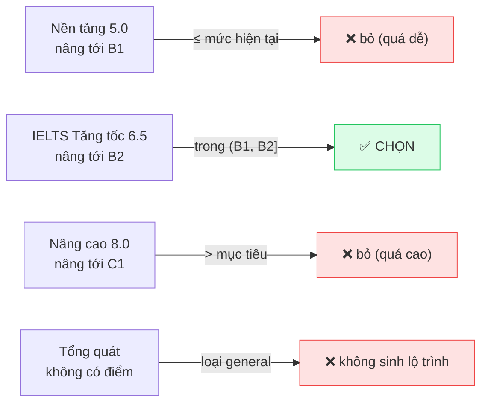
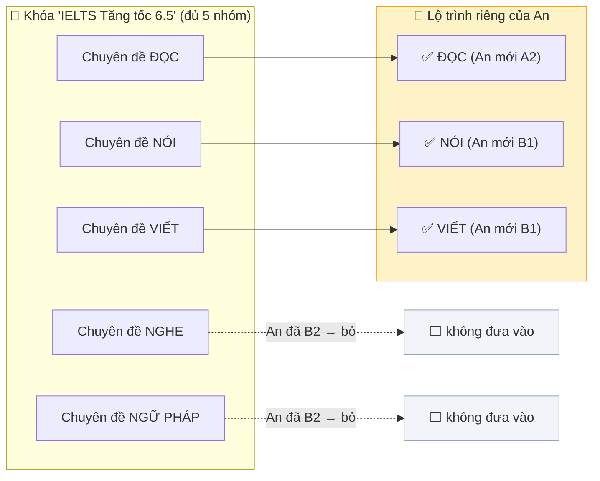
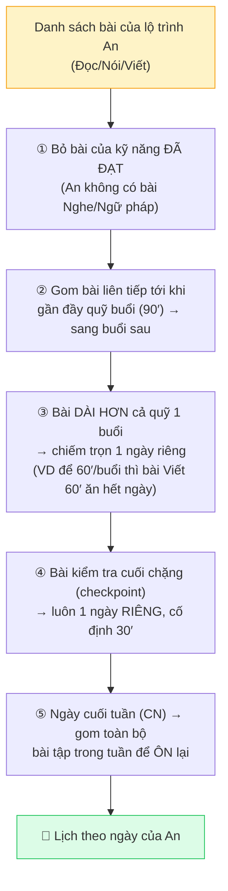
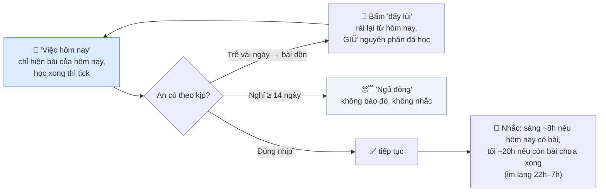
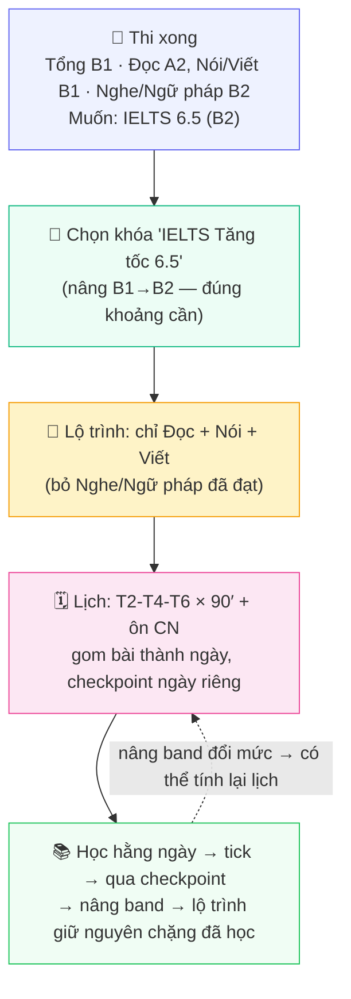

<!-- Bản xem nhanh bằng VÍ DỤ DỮ LIỆU — bám 1 học viên: khóa học phủ điểm gì → lộ trình rút gì → lịch học sinh ra sao. Đi kèm srs-luong-du-lieu-*. Số liệu từ code exe-api (2026-08-07). -->
# Ví dụ dữ liệu — Hành trình 1 học viên: Khóa học → Lộ trình → Lịch học

> **Bản xem nhanh bằng VÍ DỤ CỤ THỂ** của [SRS luồng dữ liệu tổng thể](./srs-luong-du-lieu-danh-gia-khoa-hoc-lo-trinh-lich-hoc.md) — không dùng tên trường kỹ thuật, chỉ dữ liệu đọc-hiểu-ngay.
> Bám một học viên ("An") đi suốt: **thi xong → chọn khóa nào → lộ trình rút gì → lịch học rải ra sao.**
> Con số (dải điểm, thời lượng bài, cường độ) lấy thật từ code `exe-api` (2026-08-07). Tên khóa là **minh họa**.

---

## 0. Nhân vật: học viên "An"

An vừa thi đánh giá năng lực xong. Kết quả (ví dụ):

| Kỹ năng | An đang ở | Mục tiêu | Cần luyện? |
|---|:---:|:---:|:---|
| Đọc (Reading) | **A2** | B2 | ✅ Yếu — cách đích 2 bậc |
| Nói (Speaking) | **B1** | B2 | ✅ Yếu — cách 1 bậc |
| Viết (Writing) | **B1** | B2 | ✅ Yếu — cách 1 bậc |
| Nghe (Listening) | **B2** | B2 | ⬜ Đã đạt |
| Ngữ pháp / Từ vựng | **B2** | B2 | ⬜ Đã đạt |
| **Tổng quát** | **B1** *(≈ IELTS 5.0)* | **B2** *(IELTS 6.5)* | |

> Ghi nhớ 2 con số của An: **đang B1, muốn B2**. Mọi lựa chọn khóa/lộ trình/lịch bên dưới đều xoay quanh đây.

---

## 1. Thang quy đổi CEFR ↔ IELTS ↔ TOEIC (từ mấy đến mấy)

CEFR là "thước" nội bộ; IELTS/TOEIC là điểm hiển thị. Bảng quy đổi (nguồn sự thật duy nhất):

| CEFR | IELTS (0–9) | TOEIC (10–990) |
|:---:|:---:|:---:|
| A1 | 0 – 2.0 | 120 – 224 |
| A2 | 2.5 – 3.5 | 225 – 549 |
| B1 | 4.0 – 5.0 | 550 – 784 |
| **B2** | **5.5 – 6.5** | 785 – 944 |
| C1 | 7.0 – 8.0 | 945 – 990 |
| C2 | 8.5 – 9.0 | *(không có)* |

> An "muốn IELTS 6.5" nghĩa là muốn lên **B2** (vì 6.5 nằm trong dải B2 = 5.5–6.5). Cả hệ thống quy về CEFR để tính.
> *Bên lề:* bài thi đầu vào còn nhận điểm cũ TOEFL/PTE/VSTEP/Duolingo/Cambridge để đoán mức khởi điểm — nhưng khóa học thì **chỉ** có 3 loại: Tổng quát, IELTS, TOEIC.

---

## 2. Có những khóa nào — mỗi khóa phủ điểm gì?

Mỗi khóa là **một "sản phẩm dải điểm"**: nó nâng người học *từ một mức lên một mức*. Ví dụ kho khóa (IELTS):

| Khóa (ví dụ) | Loại | Đích | Nâng từ → tới | An (B1→B2) có học? |
|---|:---:|:---:|:---:|:---|
| Nền tảng IELTS 5.0 | IELTS | 5.0 | **B1 → B1** | ❌ Quá dễ — An đã B1 rồi |
| **IELTS Tăng tốc 6.5** | IELTS | 6.5 | **B1 → B2** | ✅ **Đúng khoảng An cần** |
| IELTS Nâng cao 8.0 | IELTS | 8.0 | **B2 → C1** | ❌ Vượt mục tiêu (An chỉ cần B2) |
| Giao tiếp tổng quát | Tổng quát | — | *(không chấm điểm)* | ❌ Loại "tổng quát" không có lộ trình |

**Quy tắc chọn (đọc bằng ví dụ):** hệ thống chỉ lấy khóa **nâng tới đúng khoảng "trên mức hiện tại, không quá mục tiêu"** — tức nâng-tới nằm trong khoảng *(B1, B2]* cho An:

> **Ba tầng "khóa"** hay nhầm: kho quảng cáo có **6 nhãn** (tổng quát, IELTS, TOEIC, TOEFL, business, academic) → nhưng chỉ **3 loại** thật sự có bài để học (tổng quát, IELTS, TOEIC) → và chỉ **2 loại thi** (IELTS, TOEIC) mới dựng được lộ trình. **Tổng quát học được nhưng không có lộ trình.**

---

## 3. Lộ trình của An rút GÌ từ khóa "IELTS Tăng tốc 6.5"?

Khóa được chọn có 5 nhóm chuyên đề (Đọc/Nghe/Nói/Viết/Ngữ pháp). Lộ trình **không lấy hết** — chỉ giữ chuyên đề của **kỹ năng An còn yếu**:

Lộ trình rút từ khóa **4 nhóm dữ liệu** (nói bằng ví dụ, không bằng tên trường):

- **Chép lại y nguyên:** khóa này tên gì, thuộc IELTS, đích 6.5, nâng B1→B2, thứ tự học.
- **Chốt cứng lúc gán (không đổi về sau):** bài kiểm tra cuối chặng nào + cần đạt bao nhiêu %, và "ngân sách nâng điểm" mỗi chặng (VD: qua chặng này thì Đọc được cộng bao nhiêu về phía B2).
- **Chọn lọc:** chỉ giữ chuyên đề Đọc/Nói/Viết (bỏ Nghe/Ngữ pháp An đã đạt).
- **Đọc tươi mỗi lần mở (không lưu):** tiến độ % hiện tại + danh sách bài mới nhất của khóa.

> **Vì sao chốt cứng phần "ngân sách nâng điểm"?** Để khi An qua checkpoint và được nâng band, cấu trúc lộ trình **giữ nguyên** — chặng An đã học không biến mất, chỉ đổi sang trạng thái "đã đạt". Nếu tính lại mỗi lần, chặng đã xong sẽ bị loại và An **mất tiến độ**. (Chi tiết: [SRS §8.1](./srs-luong-du-lieu-danh-gia-khoa-hoc-lo-trinh-lich-hoc.md#81-bất-biến-ảnh-chụp-vì-sao-đóng-băng).)

---

## 4. Lịch học của An sinh ra thế nào?

Lịch = **lộ trình (danh sách bài) + quỹ thời gian An khai** → rải thành **ngày cụ thể**. Không dùng AI, cùng đầu vào luôn ra cùng lịch.

### 4.1 An khai quỹ thời gian

> "Tôi học **Thứ 2, Thứ 4, Thứ 6**, mỗi buổi **90 phút**; **Chủ nhật** ôn tập; muốn xong trong **8 tuần**."

### 4.2 Chọn cường độ — 3 mức có sẵn

Trước khi chốt, hệ thống ước tính ngày hoàn thành theo 3 mức (giả sử lộ trình An còn **480 phút** bài):

| Mức | Số buổi/tuần | Phút/buổi | Mỗi tuần | Xong 480 phút sau |
|---|:---:|:---:|:---:|:---:|
| 🐢 Thong thả | 2 | 60 | 120′ | **4 tuần** |
| ⚖️ Cân bằng *(khuyến nghị)* | 4 | 60 | 240′ | **2 tuần** |
| 🚀 Cấp tốc | 5 | 90 | 450′ | **2 tuần** |

> Nếu An đặt hạn quá gần (cần hơn **450 phút/tuần** — trần lành mạnh) → hệ thống báo **"lịch quá gấp"** và gợi ý mức Cấp tốc thay vì ép nhồi.

### 4.3 Thời lượng mỗi bài (để rải cho vừa buổi)

Mỗi loại bài có thời lượng ước tính riêng:

| Loại bài | Phút | | Loại bài | Phút |
|---|:---:|---|---|:---:|
| Lý thuyết / Video / Phát âm | 15 | | Quiz Ngữ pháp / Đọc | 20 |
| Quiz Nghe / Flashcard | 10 | | Bài Nói | 25 |
| | | | Bài Viết | 60 |

### 4.4 Một tuần lịch cụ thể của An (Thứ 2-4-6, 90′/buổi)

| Thứ | Bài trong ngày | Tổng |
|---|---|:---:|
| **T2** | Quiz Đọc (20′) + Lý thuyết (15′) + Quiz Đọc (20′) + Bài Nói (25′) | 80′ |
| T3 | — nghỉ — | |
| **T4** | Bài Viết (60′) + Lý thuyết (15′) | 75′ |
| T5 | — nghỉ — | |
| **T6** | Bài Nói (25′) + Quiz Đọc (20′) + Video (15′) | 60′ |
| T7 | — nghỉ — | |
| **CN** | 🔁 **Ôn tập**: làm lại toàn bộ bài tập đã học trong tuần | (gom) |

### 4.5 Logic rải bài — 5 quy tắc (đọc bằng ví dụ)

### 4.6 Cảnh báo tự động

- ⏰ **Trễ hạn** — lịch tính ra xong *sau* ngày An đặt → gợi ý tăng cường độ.
- 📦 **Bài quá tải** — một bài dài hơn cả quỹ 1 buổi (phải cho ngày riêng).
- 🏋️ **Ôn nặng** — ngày ôn dồn hơn *gấp đôi* quỹ 1 buổi.

### 4.7 Hằng ngày sau khi có lịch

---

## 5. Tóm tắt hành trình của An (1 hình)

> **Một câu:** *An đang B1 muốn B2 → hệ thống chọn khóa nâng đúng B1→B2, rút ra lộ trình chỉ gồm 3 kỹ năng An yếu, rồi rải thành lịch T2-4-6 mỗi buổi 90 phút với ngày ôn cuối tuần; An học — tick — qua ải — lên band, mà chặng đã học không mất.*

Chi tiết đầy đủ (thực thể, quan hệ, luồng 4 trụ cột): [SRS luồng dữ liệu tổng thể](./srs-luong-du-lieu-danh-gia-khoa-hoc-lo-trinh-lich-hoc.md).
