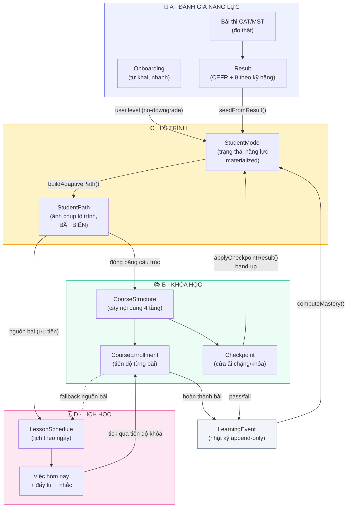
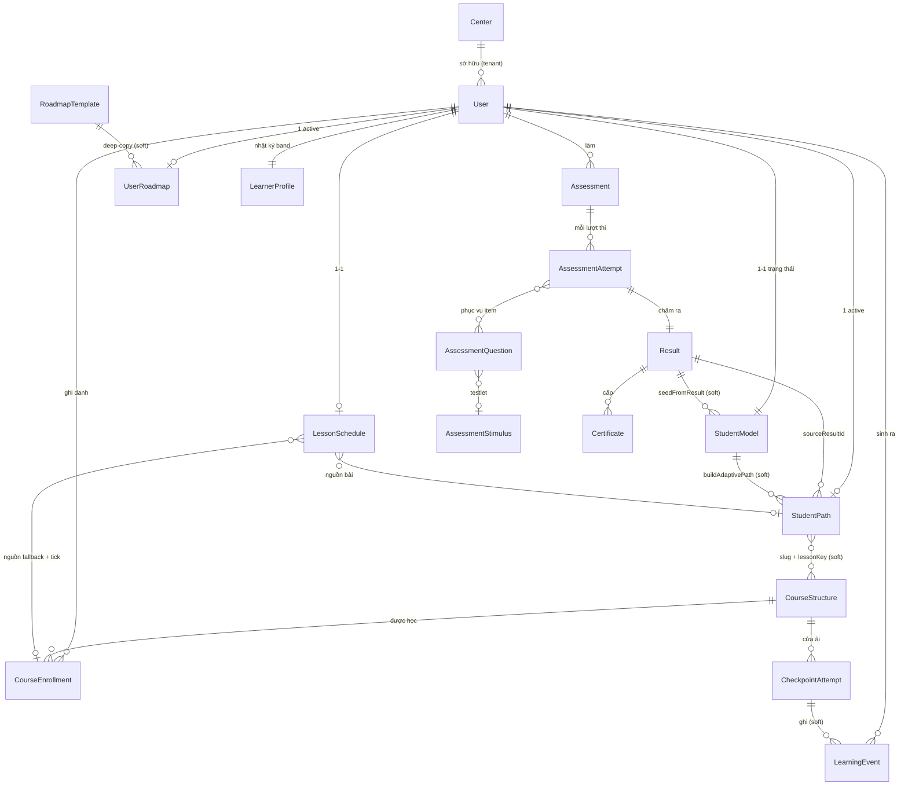
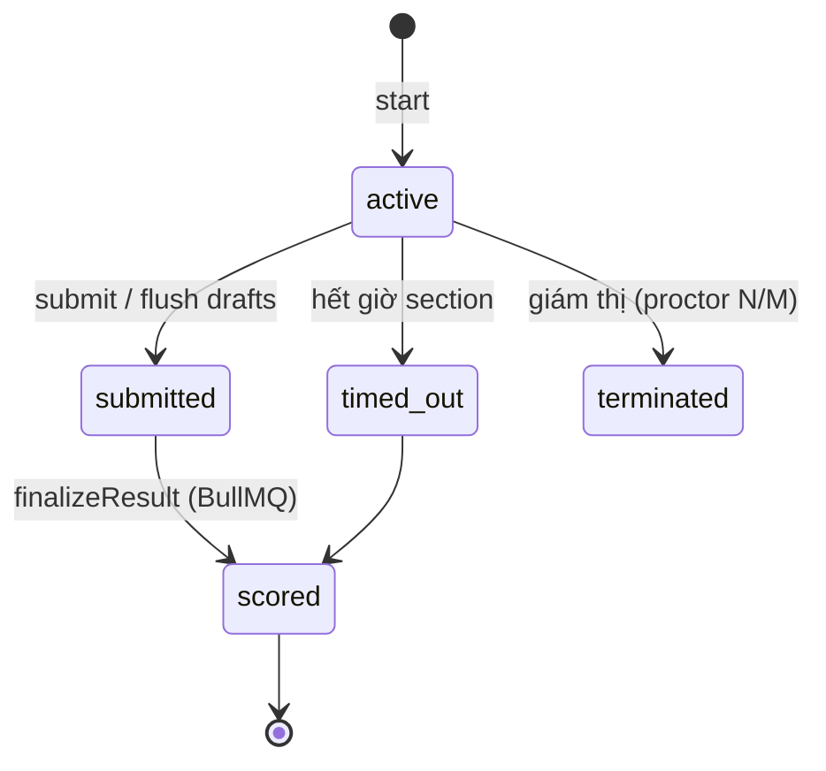
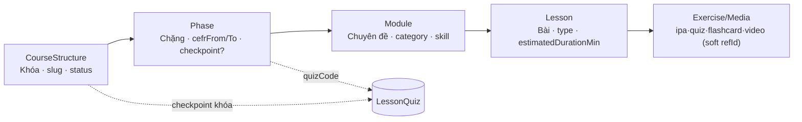
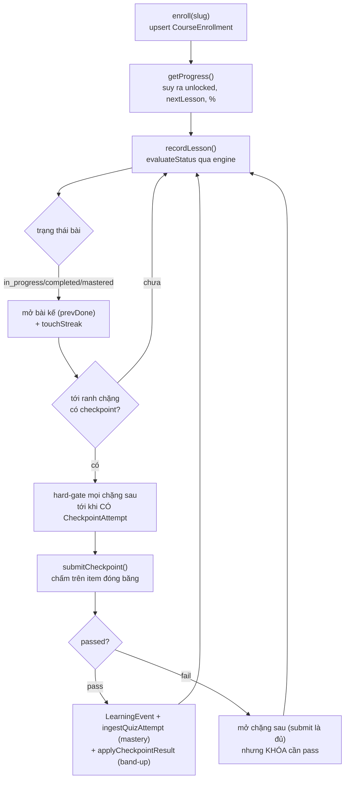
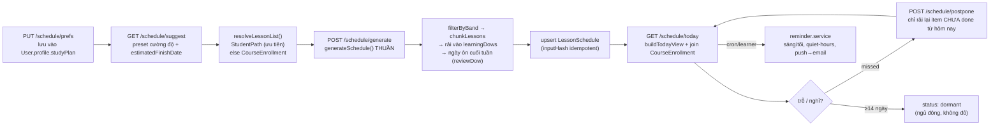
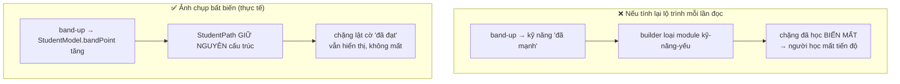

<!-- SRS luồng dữ liệu tổng thể (kiểu SRS, diagram-forward) — tổng hợp từ code exe-api (2026-08-07). Cập nhật khi model/luồng đổi. -->
# SRS — Luồng dữ liệu tổng thể: Đánh giá năng lực · Khóa học · Lộ trình · Lịch học

> **Kiểu tài liệu:** SRS (Software Requirements Spec) thiên về **mô hình dữ liệu + luồng**, diagram-forward.
> **Phạm vi:** 4 trụ cột nghiệp vụ của ENOVA/studee và cách dữ liệu chảy giữa chúng — bao quát vòng đời một người học từ lúc đăng ký đến vòng lặp học hằng ngày.
> **Nguồn:** đối chiếu trực tiếp code `exe-api/services/api/src/modules/*` (2026-08-07). Khi spec cũ và code lệch → **ưu tiên code**.
> **Cách xem:** file này nhiều sơ đồ Mermaid — mở bằng GitHub, Plane page, hoặc `/ck:markdown-novel-viewer` để render. Xem nhanh mục [§1](#1-bức-tranh-tổng-thể-1-hình) và [§3 ER](#3-mô-hình-thực-thể-er).
> **Bản xem nhanh bằng VÍ DỤ** (bám 1 học viên: khóa học phủ IELTS/TOEIC/CEFR *từ mấy đến mấy* → lộ trình rút gì → lịch học rải ra sao): [`so-do-phu-du-lieu-khoa-hoc-va-lo-trinh.md`](./so-do-phu-du-lieu-khoa-hoc-va-lo-trinh.md).

---

## Mục lục

1. [Bức tranh tổng thể (1 hình)](#1-bức-tranh-tổng-thể-1-hình)
2. [Năm "cặp đôi" cốt lõi — chìa khóa đọc hệ thống](#2-năm-cặp-đôi-cốt-lõi--chìa-khóa-đọc-hệ-thống)
3. [Mô hình thực thể (ER)](#3-mô-hình-thực-thể-er)
4. [Trụ cột A — Đánh giá năng lực](#4-trụ-cột-a--đánh-giá-năng-lực)
5. [Trụ cột B — Khóa học](#5-trụ-cột-b--khóa-học)
6. [Trụ cột C — Lộ trình](#6-trụ-cột-c--lộ-trình)
7. [Trụ cột D — Lịch học](#7-trụ-cột-d--lịch-học)
8. [Vòng lặp trung tâm: học → mastery → checkpoint → band-up](#8-vòng-lặp-trung-tâm-học--mastery--checkpoint--band-up)
9. [Bảng truy vết (flow → module/file)](#9-bảng-truy-vết-flow--modulefile)
10. [Từ điển thuật ngữ](#10-từ-điển-thuật-ngữ)
11. [Câu hỏi mở](#11-câu-hỏi-mở)

---

## 1. Bức tranh tổng thể (1 hình)

Trục xương sống là **người học (`User`)**. Dữ liệu chảy một chiều lớn: *đo năng lực → chốt hồ sơ → dựng lộ trình → rải lịch → học → ghi nhận → nâng band → lặp lại.*



**Đọc hình:** hai mũi tên đứt là *tùy chọn/fallback*. `LearningEvent` là hồ **gom mọi câu trả lời có chấm điểm** (từ thi, bài học, quiz, checkpoint) — nó nuôi `StudentModel.mastery`, và `StudentModel` là nơi **duy nhất** band-up ghi vào. `StudentPath` **không bao giờ** bị band-up sửa (xem [§2.5](#25-cặp-5--ảnh-chụp-bất-biến-vs-tính-lại-trực-tiếp)).

---

## 2. Năm "cặp đôi" cốt lõi — chìa khóa đọc hệ thống

Hệ thống cố tình **tách đôi** 5 khái niệm hay bị nhầm là một. Hiểu 5 cặp này là hiểu 80% luồng dữ liệu.

| # | Cặp đôi | Cái A | Cái B | Vì sao tách |
|---|---|---|---|---|
| 1 | **Nguồn trình độ** | `Onboarding` — tự khai, suy ra CEFR thô | `Assessment` (CAT/MST) — đo bằng IRT | Onboarding cho vào học ngay; thi thật mới chốt band. `user.level` **không hạ cấp** (thi sau chỉ nâng). |
| 2 | **Biểu diễn lộ trình** | `UserRoadmap` — lộ trình **chữ** (phase/tuần) | `StudentPath` — ảnh chụp **cấu trúc** (khóa→chặng→module→bài) | Roadmap để hiển thị tổng quan; StudentPath để chạy học + sinh lịch, đóng băng chống mất chặng. |
| 3 | **Mô hình lịch** | `LessonSchedule` — lịch **theo ngày cụ thể** (ĐANG DÙNG) | `StudySchedule` — mẫu **theo thứ trong tuần**, LLM (CŨ, route tắt) | Bản mới xác định (deterministic), không tốn LLM/quota; bản cũ để lại làm tham chiếu. |
| 4 | **Khái niệm "khóa"** | `Course` — catalog **marketing** (để gợi ý ghi danh) | `CourseStructure` — cây **nội dung học được** | Recommender chỉ đọc tag của `Course`; người học học trên `CourseStructure`. Không có FK nối 2 cái. |
| 5 | **Cập nhật lộ trình** | `StudentModel.bandPoint` — **động**, band-up cộng dồn | `StudentPath` — **bất biến**, chỉ re-plan chủ động mới đổi | Band-up chỉ đổi con số năng lực; cấu trúc lộ trình giữ nguyên → không "bay" chặng đã học. |

> **Cảnh báo cho người đọc code:** cùng một từ tiếng Việt ("lộ trình", "lịch", "khóa") ánh xạ tới **2 collection khác nhau**. Luôn hỏi "cái nào" trước khi lần theo.

---

## 3. Mô hình thực thể (ER)

Sơ đồ quan hệ **các thực thể chính** (bỏ bớt bảng phụ để dễ nhìn). Khóa ngoài cứng = `ObjectId ref`; đường **soft** (khóa chuỗi như `slug`/`quizCode`/`lessonKey`) ghi chú riêng vì Mermaid ER chỉ vẽ được quan hệ, không phân biệt cứng/mềm.



**Ghi chú quan hệ soft quan trọng** (không thấy trong ER vì là khóa chuỗi):

- `StudentPath.courses[].slug` ↔ `CourseStructure.slug`; `StudentPath...lessonKeys[]` ↔ path `"<phaseKey>/<moduleKey>/<lessonKey>"` trong `CourseEnrollment.lessons` Map.
- `Phase.checkpoint.quizCode` / `CourseStructure.checkpoint.quizCode` ↔ `LessonQuiz.code` (module `quiz`).
- `LessonSchedule.days[].items[]` lưu `courseSlug/phaseKey/moduleKey/lessonKey` (chuỗi), resolve lúc sinh lịch, **không** lưu ObjectId.
- `LearningEvent.refId` là soft đa nguồn (attemptId | lessonId | quizId | checkpointId) tùy `source`.

---

## 4. Trụ cột A — Đánh giá năng lực

**Mục tiêu SRS:** *Hệ thống đo năng lực tiếng Anh của người học theo IRT/CAT (hoặc MST), quy về CEFR theo từng kỹ năng, và chốt thành `Result` bất biến để nuôi hồ sơ + lộ trình.*

### 4.1 Thực thể chính

| Collection | Vai trò (1 dòng) | Khóa ngoại chính |
|---|---|---|
| `assessments` | 1 phiên đánh giá của 1 user; giữ cấu hình prior của CAT | `userId→User`, `centerId→Center` |
| `assessment_attempts` | 1 lượt ngồi thi; giữ state CAT sống (θ/SE, item đã phục vụ) | `assessmentId→Assessment`, items→`AssessmentQuestion` |
| `assessment_questions` | Ngân hàng câu hỏi; `answerKey` `select:false` (không lộ) | `stimulusId→AssessmentStimulus`, `rubricId→Rubric` |
| `assessment_stimuli` | Đoạn đọc / audio nghe gom 1 testlet (MST định tuyến theo `difficultyTier`) | ⟵ `AssessmentQuestion` |
| `results` | Kết quả chấm cuối: `overallCefr`, `skillScores[]`, `weakPhonemes[]`; `invalid` khi không đủ đo | `attemptId→AssessmentAttempt` |
| `learner_profiles` | 1 doc/user; log **append-only** mọi lần đổi band (audit + so tiến bộ) | `history[]`→Assessment/Attempt/Result |
| `certificates`, `rubrics`, `expert_reviews`, `proctor_events`, `angoff_ratings` | Chứng chỉ · rubric W/S · chấm người thật (QWK) · log giám thị · standard-setting | (xem code) |

### 4.2 Luồng thi (serve ↔ submit ↔ score)

```mermaid
sequenceDiagram
    autonumber
    actor U as Người học
    participant API as api (attempt.service)
    participant CAT as services/cat (IRT/MST)
    participant Q as Ngân hàng câu hỏi
    participant SC as scoring.service (BullMQ)
    participant AD as adaptive.service

    U->>API: createFromIntake (mic/net/consent, quota)
    API->>API: starting-point.computeConfig → prior(θ, SD, scope, maxItems)
    Note over API: tạo Assessment {status: intake_done}
    U->>API: start attempt
    API->>CAT: cat.start() → item Reading đầu
    loop mỗi câu, tuần tự R→L→UoE
        API->>Q: rút item (shuffle MCQ, ẩn answerKey)
        U->>API: answer
        API->>API: grade 0/1 + effort-moderation (guess→countsTowardTheta=false)
        API->>CAT: cat.answer() → θ/SE mới (EAP) + item kế
    end
    Note over API: dựng task Writing/Speaking (chấm AI sau)
    U->>API: submit → status submitted, enqueue finalize
    SC->>SC: finalizeResult(): gate đo (≥5 item, SE≤0.8) → θ→CEFR + CI 95%
    SC->>SC: chấm W/S (LLM+ASR, rubric 0–6→CEFR); computeOverall
    SC-->>API: upsert Result (hoặc invalid=true), Assessment=completed
    SC->>AD: (queue) seedFromResult(attemptId)
    AD->>AD: build LearningEvent + StudentModel + append LearnerProfile.history
```

**Bất biến:** nếu **không kỹ năng nào đo hợp lệ** → `Result.invalid=true`, **không** công bố CEFR (không đoán bừa). `starting-point` chỉ *seed* bài thi, **không** cap độ tin cậy cuối (`confidenceLabel` do độ chính xác đo + giám thị quyết định).

### 4.3 Máy trạng thái `AssessmentAttempt`



---

## 5. Trụ cột B — Khóa học

**Mục tiêu SRS:** *Hệ thống lưu nội dung khóa học dạng cây 4 tầng, cho người học đã ghi danh học tuần tự, ghi tiến độ từng bài, và chặn bằng checkpoint cuối chặng/khóa.*

### 5.1 Cây nội dung 4 tầng



Nhãn tầng (xác nhận trong `course-content.tree.js`): **Khóa / Chặng / Chuyên đề / Bài**. Node nhúng **không có `_id`**, chỉ có `key`; tham chiếu bài tập là **soft** (chuỗi `refId`), hoàn thành được *suy ra* từ engine (ipa/quiz/flashcard), không chấm lại.

### 5.2 Thực thể

| Collection | Vai trò | Khóa ngoại |
|---|---|---|
| `course_structures` | 1 doc = 1 khóa, nhúng cả cây (import Phase-1 toàn-hoặc-không) | `importedBy→User`, `centerId→Center` |
| `course_enrollments` | 1 doc/(user,khóa); Map tiến độ theo path bài; `unlocked`/% **suy ra khi đọc** | `userId→User`, `courseId→CourseStructure` |
| `checkpoint_attempts` | 1 lượt làm cửa ải chặng (`boundaryKey=phaseKey`) hoặc khóa (`'course'`) | `userId`, `courseId`, item→`AssessmentQuestion` |
| `courses` | Catalog marketing (recommender đọc tag: skills/cefr/goal) — **tách rời** cây học | `centerId→Center` |

### 5.3 Luồng học + cửa ải



**Quy tắc cửa ải:** checkpoint **chặng** chỉ cần *đã nộp* (pass hoặc fail) là mở chặng sau; checkpoint **khóa** (`'course'`) phải **pass** mới cho enrollment `completed`. Ngưỡng pass hiệu lực = `ref.passThreshold ?? lessonQuiz.passThreshold ?? 0.8`, áp cho cả điểm tổng **và** điểm từng kỹ năng.

---

## 6. Trụ cột C — Lộ trình

**Mục tiêu SRS:** *Hệ thống biến `Result` (band/CEFR) thành một lộ trình cá nhân hóa, đóng băng thành ảnh chụp `StudentPath` để nâng band không làm mất chặng đã học.*

### 6.1 Thực thể

| Collection | Vai trò | Khóa ngoại / ghi chú |
|---|---|---|
| `student_models` | Trạng thái năng lực **materialized** 1 doc/user (θ/mastery/target); recommender + coach chỉ đọc doc này | `userId` unique; `lastResultId→Result` |
| `student_paths` | **Ảnh chụp bất biến** lộ trình được gán (khóa→chặng→module→bài) + budget band đóng băng | `userId`+`isActive` partial-unique; `sourceResultId→Result` |
| `learning_events` | **Append-only**: mỗi câu trả lời có chấm (assessment/lesson/quiz/checkpoint/listening) → nguồn gốc mastery | `userId`, `questionId→AssessmentQuestion` |
| `roadmap_templates` | Blueprint admin theo *nhóm* CEFR (A1-A2/B1-B2/C1+) | standalone |
| `user_roadmaps` | Deep-copy per-user của template (lộ trình **chữ**, phase status); `templateId='adaptive'` = engine sinh | `userId`, `sourceResultId→Result` |

### 6.2 Pipeline cá nhân hóa (Result → StudentPath)

```mermaid
sequenceDiagram
    autonumber
    participant AD as adaptive.service
    participant SM as StudentModel
    participant KG as KnowledgeGraph
    participant CS as CourseStructure (published)
    participant SP as StudentPath

    Note over AD: seedFromResult(attemptId)
    AD->>SM: skillMapFromResult (θ/SE/cefr, bandPoint) + computeMastery(events)
    AD->>AD: getProfileView → gap/kỹ năng yếu; resolveTarget → program + CEFR đích
    AD->>CS: nạp khóa published của program
    AD->>KG: subskill → primarySkill
    AD->>AD: buildAdaptivePath({level,target,skills,courses})<br/>→ khóa trong (floor, target], mỗi chặng giữ module kỹ-năng-yếu
    AD->>SP: buildSnapshotFromPath → computeSkillBudgets<br/>(skillBudget=gain/n mỗi chặng; skillTarget=min(trần khóa, đích))
    Note over SP: student_paths {isActive:true} — ĐÓNG BĂNG cấu trúc + budget
```

### 6.3 Đọc lộ trình = ảnh chụp + phủ lớp sống

Khi đọc (`getAdaptivePath`): lấy `StudentPath` bất biến → `dtoFromSnapshot` dựng lại DTO → **phủ lớp sống**: `mastered` (bandPoint ≥ skillTarget đóng băng → "đã đạt"), `allModules` lấy tươi từ `CourseStructure`, và % tiến độ từ `CourseEnrollment` qua `lessonKeys`.

---

## 7. Trụ cột D — Lịch học

**Mục tiêu SRS:** *Hệ thống biến `StudentPath` (hoặc khóa đang học) + quỹ thời gian khai báo thành lịch học theo ngày xác định, phục vụ "việc hôm nay", đẩy lùi khi trễ, và nhắc học.*

### 7.1 Thực thể

| Collection | Vai trò | Khóa ngoại / ghi chú |
|---|---|---|
| `lesson_schedules` | **ĐANG DÙNG** — lịch theo ngày cụ thể; 1 doc/user, thay mới khi regen | `userId` unique; `inputHash` để bỏ regen khi input không đổi |
| `study_schedules` | **CŨ (route tắt)** — mẫu theo thứ trong tuần, LLM + fallback rule-based | `sourceRoadmapId→UserRoadmap`; `prefsHash` |

Prefs (`learningDows`, `reviewDow`, `focusDurationMin`, `deadline`, `timezone`) nằm trên **`User.profile.studyPlan`**, **không** trong doc lịch. Module `plan/` là **catalog gói cước** (subscription/pricing), **không** liên quan lịch học.

### 7.2 Vòng đời lịch (LessonSchedule)



**Xác định (deterministic) + idempotent:** `generateSchedule` là hàm thuần (không LLM); `inputHash = MD5(lessons + pref + bands + asOfDate)` — trùng thì trả cache. Cảnh báo: `overdue` (xong sau deadline), `oversized` (1 bài > cap ngày), `heavy_review` (ngày ôn > 2× cap). Bài quá khổ được **1 ngày riêng không cap**; checkpoint chiếm **1 ngày riêng cố định 30 phút**.

---

## 8. Vòng lặp trung tâm: học → mastery → checkpoint → band-up

Đây là "trái tim" nối cả 4 trụ cột — vòng lặp hằng ngày sau khi đã có lộ trình + lịch.

```mermaid
sequenceDiagram
    autonumber
    actor U as Người học
    participant SCH as LessonSchedule (today)
    participant CE as CourseEnrollment
    participant LE as LearningEvent
    participant SM as StudentModel
    participant CP as Checkpoint
    participant SP as StudentPath (bất biến)

    U->>SCH: mở "việc hôm nay"
    SCH->>CE: join done/missed (deep-link bài)
    U->>CE: học bài → recordLesson()
    CE->>LE: ghi event (source: lesson/quiz)
    LE->>SM: computeMastery() → cập nhật mastery/skill
    Note over SM: mastery ≥ 0.85 → readyForCheckpoint
    U->>CP: làm checkpoint chặng
    CP->>LE: ghi event (source: checkpoint)
    CP->>SM: applyCheckpointResult()<br/>bandPoint += skillBudget (đóng băng), clamp skillTarget
    Note over SM,SP: band-up chỉ ghi StudentModel;<br/>StudentPath KHÔNG đổi → không mất chặng
    SM-->>SCH: band mới → filterByBand lần regen sau
```

### 8.1 Bất biến ảnh chụp (vì sao đóng băng)



Chỉ **re-plan chủ động** (`setTarget` đổi đích, hoặc thi lại tạo `Result` mới) mới `archive` ảnh cũ và tạo `StudentPath` mới. `skillBudget`/`skillTarget` đóng băng lúc gán → band-up cộng dồn **xác định**, không vượt đích lúc gán.

---

## 9. Bảng truy vết (flow → module/file)

Cho kỹ sư lần từ nghiệp vụ về code (`exe-api/services/api/src/modules/`):

| Luồng | Module / file chính |
|---|---|
| Onboarding placement | `onboarding/onboarding.service.js`, `onboarding.placement.js` |
| Starting-point config | `assessment/starting-point.engine.js` |
| CAT runner (serve/answer/submit) | `assessment/attempt.service.js` (+ adapter `services/cat`) |
| Chấm điểm → Result | `assessment/scoring.service.js`, `band-scoring.js` |
| Seed hồ sơ từ Result | `adaptive/adaptive.service.js#seedFromResult` |
| Dựng lộ trình | `adaptive/adaptive-path-builder.js`, `student-path.service.js` |
| Đọc lộ trình (snapshot+overlay) | `adaptive/adaptive-path-snapshot-view.js` |
| Nội dung khóa + tiến độ | `course-content/course-content.progress.service.js`, `.tree.js` |
| Checkpoint chặng/khóa | `checkpoint/checkpoint.service.js`, `.verdict.js` |
| Band-up | `adaptive/adaptive.service.js#applyCheckpointResult`, `band-point.js` |
| Sinh lịch (thuần) | `adaptive/schedule/lesson-schedule.generator.js`, `lesson-list.resolver.js` |
| Việc hôm nay / đẩy lùi / nhắc | `adaptive/schedule/today-view.js`, `postpone.js`, `reminder.service.js` |

Spec chi tiết từng feature: `studee-workspace/specs/` (adaptive-path, course-checkpoints-band-up, study-schedule-*, …); tổng quan lịch: `docs/m4-personalized-study-schedule-overview.md`; hồ sơ năng lực: `docs/feature-spec-ho-so-nang-luc.md`.

---

## 10. Từ điển thuật ngữ

- **CEFR** — khung A1→C2; "spine" mọi điểm quy về.
- **θ (theta) / SE** — ước lượng năng lực ẩn IRT + sai số chuẩn (EAP), lưu trên `attempt.cat[skill]`, map sang CEFR.
- **bandPoint** — vị trí CEFR **liên tục** 1.0–6.0; phần nguyên = band CEFR, phần thập phân = tiến độ trong band; hiển thị `cefr = floor(bandPoint)`.
- **Band** — điểm kiểu IELTS 1–9 (bước 0.5), chỉ dùng nhánh MST; "rubric band" 0–6 cho W/S.
- **Testlet / Stimulus** — cụm câu chung 1 đoạn đọc/audio (`stimulusId`); MST định tuyến theo `difficultyTier`.
- **MST / CAT** — Multi-Stage Testing (định tuyến theo testlet) vs Computerized Adaptive Testing (từng item θ-routed).
- **Checkpoint / band-up** — cửa ải chặng/khóa gắn `LessonQuiz`; pass từng kỹ năng → cộng `bandPoint` từ budget đóng băng.
- **Mastery** — 0..1 theo subskill, gom từ `LearningEvent` (Σ w·correct / Σ w, w = độ khó item).
- **StudentPath (snapshot)** — ảnh chụp bất biến lộ trình được gán; sống sót qua band-up.
- **inputHash / prefsHash** — MD5 để bỏ regen khi input không đổi (idempotent).
- **dormant** — ngủ đông ≥14 ngày không hoạt động; lịch không báo đỏ, được loại khỏi vòng nhắc.

---

## 11. Câu hỏi mở

1. `StudySchedule` (mẫu tuần LLM) đã **tắt route** — có kế hoạch xóa hẳn hay giữ làm nhánh dự phòng? Tài liệu đang mô tả cả hai để tránh nhầm.
2. Cut-score θ→CEFR hiện là **PLACEHOLDER** (`Result.ciPlaceholder=true`), chờ Standard Setting (Angoff). Khi chốt cut thật, các band trong ER/flow ở đây không đổi cấu trúc nhưng con số sẽ dịch — cần cập nhật mục A khi OI-01 xong.
3. `Course` (catalog) và `CourseStructure` (cây học) không có FK nối. Nếu sau này recommender cần deep-link từ gợi ý marketing sang khóa học thật, sẽ phải thêm khóa nối — hiện chưa có, cố ý.
4. `mastered` mới đạt ở nhánh IPA; quiz/flashcard cap ở `completed`. Có mở rộng mastery cho quiz/flashcard không?
