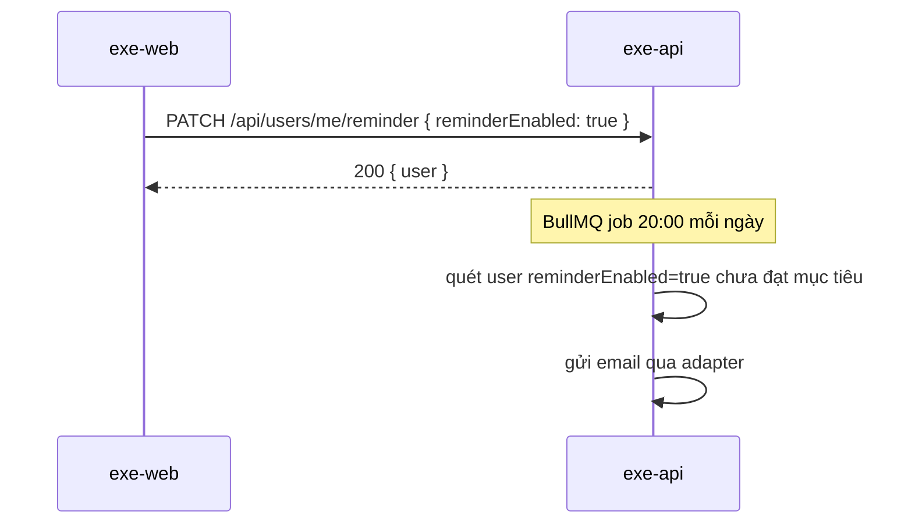

<!-- VÍ DỤ MINH HOẠ — xem ghi chú ở specs/example-feature/spec.md -->
# Diagrams

Thư mục này chứa diagram (sequence/flow/ERD) cho feature, khi văn bản không đủ rõ. Không bắt buộc cho mọi
feature — chỉ tạo khi luồng đủ phức tạp để cần hình.

Định dạng khuyến nghị: Mermaid trong file `.md` (render được trực tiếp trên GitHub), hoặc `.png`/`.svg` xuất từ
công cụ khác kèm 1 file `.md` mô tả ngắn nguồn gốc.

Ví dụ (không phải diagram thật của feature ví dụ này):

